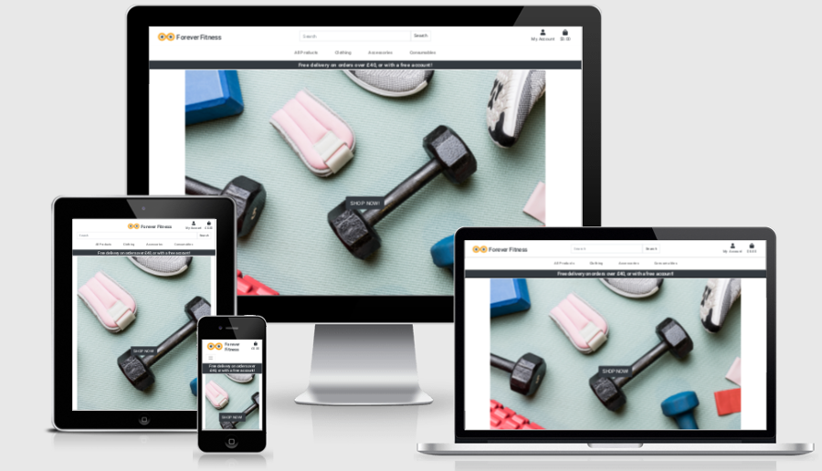
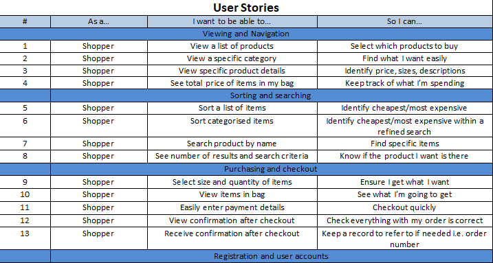
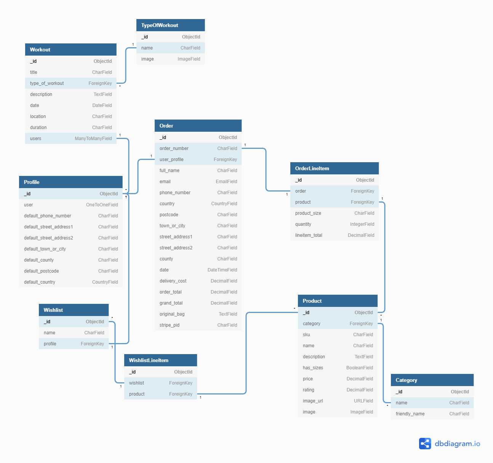

# Forever Fitness
## Milestone Project 4

As part of my Full-Stack development course I have created a Full-Stack site based on busisness logic around a centrally owned database.
Forever Fitness is a fictional company which aims to sell fitness products and offer fitness classes.
[Link to Live Site!](https://ellis-forever-fitness.herokuapp.com/)
# Contents

- [User Experience](#user-experience)
    - [Strategy](#strategy)
        - [User Stories](#user-stories)
        - [Structure](#structure)
    - [Design](#design)
        - [Database Schema](#database-schema)
        - [Apps/Models](#apps-models)
        - [Wireframes](#wireframes)
    - [Features](#features)
- [Technologies](#technologies)
    - [Languages](#languages)
    - [Libraries, Frameworks and programs](#libraries-frameworks-and-programs)
- [Testing](#testing)
- [Bugs and Fixes](#bugs-and-fixes)
- [Deployment](#deployment)
- [Credits](#credits)

# User Experience

## Strategy

### User goals
- Find fitness related products
- Attened fitness classes

### Site owner goals
- Provide an enjoyable user experience
- Offer a range of relevent products
- Get returning customers

### User Stories

### Structure 

- Consistancy and intuitiveness throughout the site.
- Users are able to access the main areas; Products, Profile and Shopping Bag, within 3 clicks from any page.
- Base template containing the navigation section and displaying it across the whole site.
- Each call to action and all links clearly and simply explain their intention.

## Design

### Database Schema

### Apps/Models

- Bag app:
    - Containts context.py which stores logic for the shopping bag and delivery costs usable across the whole site
---
- Checkout app:
    - Order model:
        - Foreign key = Profile
        - Contains information about each order including; customer information, users profile, delivery cost and order total.
        - Generates a unique order number.
        - Updates the total using items from OrderLineItem model.
    - OrderLineItem model:
        - Foreign key = Order, Product
        - Stores if a product has a size and the quantity.
        - Saves the total price if contains multiples of the save product.
---
- Products app:
    - Category model:
        - Contains category name.
    - Product model:
        - Foreign key = Category
        - Contains information on each product including if it has sizes.
---
- Profile app:
    - Profile model:
        - One to One connection relationship User model
        - Contains delivery information about the user
---
- Wishlist app:
    - Wishlist model:
        - foreign key = Profile
        - Contains items from WishlistLineItem model
    - WishlistLineItem model:
        - foreign key = Wishlist, Product
---
- Workouts app:
    - TypeOfWorkout model:
        - Contains a name and image
    - Workout model:
        - foreign key = TypeOfWorkout
        - Many to Many relationship with Profile model
        - Contains information about the workout i.e date, location
---

### Wireframes

- [Checkout Page desktop-tablet-phone](docs/README-imgs/checkout.png)
- [Home Page desktop-tablet-phone](docs/README-imgs/home_page.png)
- [Item Details Page desktop-tablet-phone](docs/README-imgs/item_details.png)
- [Products Page desktop-tablet-phone](docs/README-imgs/products.png)
- [Shopping basket Page desktop-tablet-phone](docs/README-imgs/shopping_basket.png)

## Features

### Nav Section
The Navigation section is constant across the whole of the site, the menues turn into collapsibles at smaller screen sizes.
- **Logo and brand name**: Links to the home page
- **Search bar**: Filters products by name and description
- **'My account'**: Dropdown menu
    
    *if user is Anonymous*
    - **'Register'**: Links to signup page
    - **'Login'**: Links to login page

    *If user is Authorised*
    - **'My Profile'**: Links to user profile
    - **'Logout'**: Links to logout page   
    
    *If user is Super User*
    - **'Product Management'**: Links to add product page
    - **'Class Management'**: Links to add workout page
    - **'My Profile'**: Links to user profile
    - **'Logout'**: Links to logout page  
- **Shopping basket**: Displays price and links to shopping bag page
- *Sort/Filter selection*
    - **'All Products'**: Dropdown menu
        -**'By Price'**: Links to products page and sorts all products by price
        -**'By Rating'**: Links to products page and Sorts all products by rating
        -**'By Category'**: Links to products page and Sorts all products by category
        -**'All Products'**: Links to products page
    - **'Clothing'**: Dropdown menu
        - **Shorts**: Links to products page and filters by category 'shorts'
        - **Tops**: Links to products page and filters by category 'tops'
        - **All Clothing**: Links to products page and filters by category 'tops' & 'shorts'
    - **'Accessories'**: Dropdown menu
        - **Yoga**: Links to products page and filters by category 'yoga'
        - **Boxing**: Links to products page and filters by category 'boxing'
        - **All Accessories**: Links to products page and filters by category 'yoga' & 'boxing'
    - **'Consumables'**: Dropdown menu
        - **Powders**: Links to products page and filters by category 'Powders'
        - **Bars**: Links to products page and filters by category 'Bars'
        - **All Consumables**: Links to products page and filters by category 'Powders' & 'Bars'
### Home Page
*if user is Anonymous*
- **SHOP NOW!**: button over an image of workout equipment, links to products page
*If user is Authorised*
- **SHOP NOW!**: button over an image of workout equipment, links to products page
- **'MEMBERS AREA'**: button over an image of people working out, links to workouts page
### Products Page
- **'Products'**: Page header
- **Product Count**: Shows number of products found for current search
- **Sort By**: Sort selector menu for price, rating, name and category both accending and decending. Reloads page with selected sorting 
- **Product Card**
    - **Product Image**: Links to product details page
    - **Product info**: Product name, price category and rating
    *if user is Authorised*
    - **Add to Wishlist Heart**: Creates wishlist (if user doesnt have one) and adds selected item to it
    *if user is superuser*
    - **'Edit Product'**: Links to edit product page
    - **'Delete Product'**: Links to delete product page
### Product Details Page
- **'Product Details'**: Page header
- **Product Image**
- **Produc Info**: Product name, price, category, rating and descripting
- **Size Selector**: Dropdown box with sizes XS-XXL
- **Quantity Selector**: Integer box with '+' and '-' buttons to increase/decrease quantity of item
- **'Add to Bag**: Button which adds item to shopping bag, displays success message, and shows preview of bag items and total.
- **'Continue Shopping**: Button which links to products page
- **'Go To Checkout'**: Button which links to shopping bag
### Bag page
- **'Shopping Bag**: Page header
- **'Product Info'**: Table header 1
    - **Products Image**
    - **Product Name**
    - **Product SKU number**
- **'Size'**: Table header 2
    - **Product Size**: Product size code i.e XS-XXL
- **'Qty'**: Table header 3
    - **Quantity Selector**: Integer box with '+' and '-' buttons to increase/decrease quantity of item
    - **'Update'**: link that refreshes bag page with new quantity and subtotal updated.
- **'Subtotal'**: Table header 4
    - **Subtotal**: Price of item X Quantity of item
- **'X'**: Red X which removes item(s) from bag
- **'Bag Total'**: Total price of all items in bag
- **'Delivery'**: Cost of delivery
- **'Grad Total'**: Total price of all items in bag + delivery cost
- **'Continue Shopping**: Button which links to products page
- **'Go To Checkout'**: Button which links to Checkout page
### Checkout Page
- **'Checkout'**: Page header
- **Order Summary**: Miniture view of bag page, including: item count, product image, product name, size, quantity, subtotal, order total, delivery costs and grand total
- **Order Form**: Form for users name, email address, delivery address.
    - **Save details**: Checkbox to save users details to profile for quicker checkout
- **Payment form**: Form for card details
- **'Adjust Bag'**: Button which links to bag page
- **'Complete Order'**: Button which checks forms are valid, requests payment from card and sends details to stripe, then loads checkout success page and success message.
- **Charge warning**: Warning under buttons telling user how miuch the card will be charged
### Checkout Success Page
- **Checkout details**: Table showing order number, order date, order items, delivery details, order total, delivery cost and grand total
- **'Back To Home Page'**: Button which links to home page 
### Workouts Page
- **'Members Area'**: page heading
- **'Workout Routines'**: Sub heading
- **Class Card**: Contains information about the workout
    - **Class image**: An image of the type of class i.e yoga, running
    - **Class info**: Class name, type, date, location and duration.
        *if user is superuser*
        - **'Edit Workout'**: Links to edit workout page
        - **'Delete Workout'**: Links to delete workout page
    - **'Add To My Classes'**: Button which adds the workout class to users 'my workouts' sections of their profile and displays a success message.
### My Profile Page
- **'My Profile'**: Page header
- **Defauly Deliver Info**: Form for users default delivery information
- **Update Info**: Button which reloads page, saves default delivery information and displays a success message
- **'My Workout Classes'**: Button over an image of group workout, links to 'my workouts' page
- **'My Order'**: Button over an image of delivery boxes, links to 'my orders' page
- **'My Wishlist'**: Button over an image of weights with a bow, links to 'my wishlist' page
### My Workouts Page
- **'My Workouts**: Page header
- **'Back to Profile**: Link to 'my profile' page
- **Class Card**: Contains information about the workout
    - **Class image**: An image of the type of class i.e yoga, running
    - **Class info**: Class name, type, date, location and duration.
- **'Remove from my classes'**: Button which removes the workout class from users 'my workouts' sections of their profile and displays a success message.
### User Orders Page
- **'My Orders'**: Page header
- **'Back to Profile**: Link to 'my profile' page
- **Order history table**: Stores all of users past orders
    - **'Order Number'**: Table header 1
        - **Order number**: Order number which links to checkout success page for that order and displays warning message that this is a past order
    - **'Date'**: Table header 2
        - **Date**: Date the order was made
    - **'Items'**: Table header 3
        - **Order Items**: List of items in order including their name, size and quantity
    - **'Order Total'**: Table header 4
        - **Order Total**: Total price of the order
### My Wishlist Page
- **'My Wishlist'**: Page header
- **'View Products**: Link to 'products' page
- **'Back to Profile**: Link to 'my profile' page
- **Product Card**
    - **Product Image**: Links to product details page
    - **Product info**: Product name, price category and rating
    - **'Remove From Wishlist'**: Link which removes item from wishlist and loads users Wishlist

*if user is superuser*
### Add Product Page
- **'Product Management'**: Page header
- **'Add Product'**: Subheader
- **Product form**: Form for adding product, includins: Category, Sku, Name, Description, Has Sizes, Price, Rating, Image Url, Image (**Choose file** button)
- **'Cancel'**: Button which abandons the form and loads products page
- **'Add Product'**: Button which checks form is valid, submits form and loads products page
### Add Workout Page
- **'Class Management'**: Page header
- **'Add Workout'**: Subheader
- **Workout form**: Form for adding a workout, includes: Title, Type, Description, Date, Location, Duration
- **'Cancel'**: Button which abandons the form and loads home page
- **'Add Product'**: Button which checks form is valid, submits form and loads Workouts page

## Future Features

# Technologies

## Languages
- Python
- HTML
- CSS
- JavaScript

## Libraries, Frameworks and Programs Used
- Git
- Gitpod
- Bootstrap
- Django
- Font Awesome
- Postgres
- Balsamiq

# Testing

For practicality the testing has been documented in a seperate file that can be found [Here](TESTING.md).

# Deployment

- The app was deployed on Heroku and used Amazon Web Services to store static and media files.

## Creating a Heroku App

- Registier/login on [Heroku](https://www.heroku.com/).
- Click 'New' > 'Create new app'.
- Give the app a name.
- Select the region closest to you.

## Setting up Postgres Database
- On your Heroku app:
    - Select 'Resources' tab.
        - Search and select 'Heroku Postgres' add-on.

- In your work enviroment:
    - install `dj_database_url` and `psycopg2-binary` and update requirements.txt file
    
    - In settings.py:
        - import `dj_database_url`
        - Temporarily change your default DATABASES config to: `'default': dj_database_url.parse( YOUR_DATABASE_URL )` using the database url from your heroku app config vars. **After you apply the migrations, change DATABASES config back, so your database doesnt end up in version control**
    - Apply migrations to new database useing *migrate* command in the terminal.
    - Create a superuser using *createsuperuser* command in the terminal.
    - In settings.py:
        - Connect your project to the postgres database for the live site, and your default database for version control, using the config variable from Heroku by adding `if 'DATABASE_URL' in os.environ: DATABASES = {'default': dj_database_url.parse(os.environ.get('DATABASE_URL'))} else:`
    before your default database settings
    - Install `gunicorn` and update requirements.txt file.
    - Create Procfile and add `web: gunicorn <YOUR_APP_NAME>.wsgi:application`
    - Temporarily add `DISABLE_COLLECTSTATIC` to heroku config vars with value of `1` so heroku doesnt try to collect static files when you deploy
    - in serrings.py:
        - add hostname of your heroku app to ALLOWED_HOSTS
    - Add and commit your changes, then push to heroku (I used gitpod so the command was `git push heroku main`)

## Setting up automatic deployment
- in heroku app:
    - Select the 'Deploy' tab:
        - Choose your deployment method i.e gitpod
        - Search for your repository
        - Click connect
        - Enable automatic deploy

# Credits

## Images