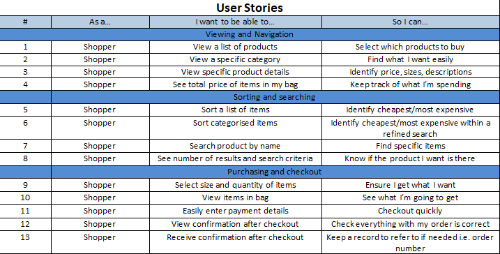
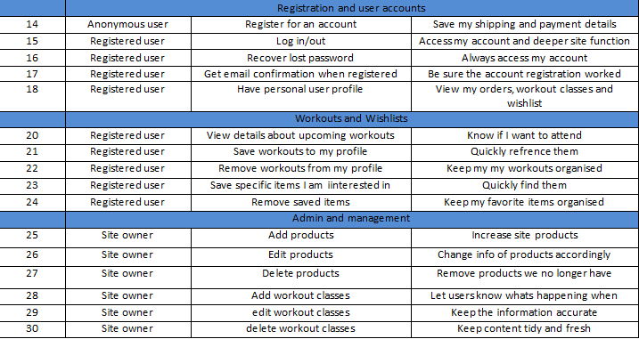
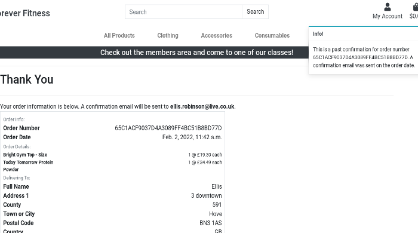
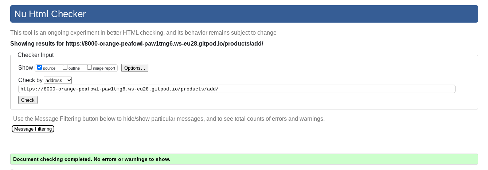
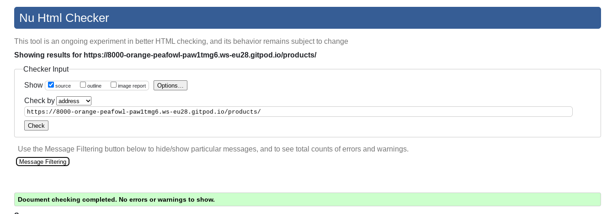

# Testing 

- Chrome developer tools were used to help fault find any style issues
- After each feature was created I would manually test that it worked as expected, and fix any obvious bugs before moving on to the next one
- Every form was manually tested to make sure the expected validation and restrictions were in place
- PEP8 was used to test python files, any problems were then manually resolved

# Contents
- [User Stories](#user-stories)
    - [User Story 1](#user-story-1)
    - [User Story 2](#user-story-2)
    - [User Story 3](#user-story-3)
    - [User Story 4](#user-story-4)
    - [User Story 5](#user-story-5)
    - [User Story 6](#user-story-6)
    - [User Story 7](#user-story-7)
    - [User Story 8](#user-story-8)
    - [User Story 9](#user-story-9)
    - [User Story 10](#user-story-10)
    - [User Story 11](#user-story-11)
    - [User Story 12](#user-story-12)
    - [User Story 13](#user-story-13)
    - [User Story 14](#user-story-14)
    - [User Story 15](#user-story-15)
    - [User Story 16](#user-story-16)
    - [User Story 17](#user-story-17)
    - [User Story 18](#user-story-18)
    - [User Story 20](#20)
    - [User Story 21](#user-story-21)
    - [User Story 22](#user-story-22)
    - [User Story 23](#user-story-23)
    - [User Story 24](#user-story-24)
    - [User Story 25](#user-story-25)
    - [User Story 26](#user-story-26)
    - [User Story 27](#user-story-27)
    - [User Story 28](#user-story-28)
    - [User Story 29](#user-story-29)
    - [User Story 30](#user-story-30)

- [Code Validation](#code-validation)
    - [add product](#add-product)
    - [add workout](#add-workout)
    - [bag](#bag)
    - [checkout success](#checkout-success)
    - [checkout](#checkout)
    - [delete product](#delete-product)
    - [delete workout](#delete-workout)
    - [edit product](#edit-product)
    - [edit workout](#edit-workout)
    - [home](#home)
    - [members area](#members-area)
    - [my workouts](#my-workouts)
    - [products](#products)
    - [profile](#profile)
    - [users orders](#users-orders)
    - [wishlist](#wishlist)

## User Stories

**#1**

**#2**

**#3**

**#4**

**#5**

**#6**

**#7**

**#8**

**#9**

**#10**

**#11**

**#12/13**

**#14**

**#14/15**

**#15**

**#16**

**#17**

**#18**

- **#20**

**#21**

**#22**

**#23**

**#24**

**#25**

**#26**

**#26/27**

**#27**

**#28**

**#29**

**#29/30**

**#30**

# Code Validation

**add product**

**add workout**

**bag**

**checkout success**

- **checkout**

**delete product**

**delete workout**

**edit product**

**edit workout**

**home**

**members area**

**my workouts**

**products**

**profile**

**users orders**

**wishlist**

